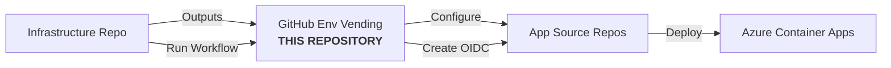

# GitHub Environment Vending for Azure Container Apps

> **Note:** This module is specifically tailored for developer teams building on the Stratus Corp Azure Landing Zone with Container App Environment. It is optimized for greenfield infrastructure-as-code (IaC) repositories created for each new system or team starting their journey in Stratus. Some input variables and design choices are opinionated for this workflow. **This module may not be the optimal choice for other use cases or non-Stratus environments.**

---

## How This Module Fits in the Stratus Workflow

This module is **not a standalone solution**. It is designed to be used as part of a larger, connected deployment process:

> **Note**: In the diagram below, "GitHub Env Vending" refers to **this repository** (stratus-tf-aca-gh-vending).



### End-to-End Example Flow

1. **Provision Infra:**  
   Run Terraform in your IaC repo to create ACE, ACR, etc. We recommend using the [Stratus Terraform Examples](https://github.com/HafslundEcoVannkraft/stratus-tf-examples/tree/main/examples/corp/container_app) for corporate Container Apps deployments. These examples provide tested, production-ready infrastructure patterns aligned with Stratus best practices.

2. **Configure GitHub Environments:**  
   - Edit `stratus-aca-github-environments.yaml` in the IaC repo to describe which app repos/environments to configure.
   - Run the provided workflow (via GitHub CLI) with the required inputs (`github_token`, `tfvars_path`).

3. **App Source Repo Usage:**  
   - Developers in the app repo can now use the configured environments for secure, OIDC-based deployments to Azure.
   - **Why vend the source repos?** Each source repo (e.g., frontend, backend, APIs) needs its own OIDC identity and GitHub environment to:
     - Push container images securely to the Azure Container Registry (ACR) using federated credentials (no static secrets).
     - Deploy new container apps or update existing apps in the Azure Container App Environment.
   - In larger systems, you may have multiple source repos (e.g., frontend, backend, microservices) that each require their own environment configuration and permissions. This module enables you to vend and manage these environments centrally and securely from your IaC repo.

> **Note:**  
> This module is a **building block** in a larger Stratus deployment. It does not provision Azure infra or manage app source code. It configures GitHub environments and permissions so that remote app repos can deploy to the infra you provisioned.

---

## Table of Contents

- [Features](#features)
- [Prerequisites](#prerequisites)
- [Usage](#usage)
- [Configuration Reference](#configuration-reference)
  - [YAML Structure](#yaml-structure)
  - [Reviewers Configuration](#reviewers-configuration)
  - [Branch Policies](#branch-policies)
  - [Tag Policies](#tag-policies)
  - [Environment Variables and Secrets](#environment-variables-and-secrets)
- [Azure Resources Created](#azure-resources-created)
- [GitHub Action Integration](#github-action-integration)
- [Common Issues and Troubleshooting](#common-issues-and-troubleshooting)
- [Understanding GitHub Environments and Deployments](#understanding-github-environments-and-deployments)
  - [What are GitHub Environments?](#what-are-github-environments)
  - [How Environments Work with GitHub Actions](#how-environments-work-with-github-actions)
  - [Best Practices for Environment Configuration](#best-practices-for-environment-configuration)
  - [Security Considerations with OIDC Federation](#security-considerations-with-oidc-federation)
  - [Common Troubleshooting](#common-troubleshooting)
  - [Recommended Workflow Configurations](#recommended-workflow-configurations)
- [GitHub Actions Workflow Example](#github-actions-workflow-example)

## Features

- **GitHub Environment Management**: Automatically create and configure environments in GitHub repositories
- **OIDC Federation**: Establish secure, token-based authentication between GitHub Actions and Azure
- **Azure Role Assignments**: Set up proper Azure RBAC for each environment
- **Deployment Branch Policies**: Control which branches can deploy to specific environments
- **Deployment Tag Policies**: Create tag-based deployment rules for environments
- **Required Approvals**: Establish approval requirements for deployments
- **Configuration as Code**: Define your entire setup using YAML

### What this module does NOT handle

- **Tag Protection**: This module doesn't configure tag protection rules (preventing tags from being deleted)
- **Branch Protection**: This module doesn't set up branch protection rules at the repository level
- **Repository Creation**: Repositories must already exist before using this module
- **Organization Management**: Organization settings are not managed by this module

This module is specifically focused on setting up the connection between GitHub Actions environments and Azure Container Apps, with appropriate security controls.

## Prerequisites

- GitHub repository with proper permissions
- GitHub token with `repo` and `workflow` permissions
- Azure subscription with contributor rights
- Terraform >= 1.3.0

## Usage

1. **Prepare your configuration**

Make sure you have your required variables defined in a tfvars file (for example: `deployments/tfvars/<environment>.tfvars`).

2. **Create a `stratus-aca-github-environments.yaml` file**

```yaml
repositories:
  - repo: api-service
    environments:
      - name: development
        wait_timer: 0
        prevent_self_review: false
        reviewers:
          users:
            - username: "johndoe"
          teams:
            - name: "developers"
        deployment_branch_policy:
          protected_branches: false
          custom_branch_policies: true
          custom_branches:
            - "main"
            - "feature/*"
        deployment_tag_policy:
          enabled: false
          tag_patterns: []
      - name: production
        wait_timer: 10
        prevent_self_review: true
        reviewers:
          users:
            - username: "security-admin"
          teams:
            - name: "approvers"
        deployment_branch_policy:
          protected_branches: true 
          custom_branch_policies: false
        deployment_tag_policy:
          enabled: true
          tag_patterns:
            - "v*"
            - "release-*"
```

3. **Run the GitHub Actions workflow**

The recommended and secure way to apply this configuration is to use the GitHub CLI to trigger the provided workflow. This workflow will handle all Terraform operations for you.

You can use either the GitHub CLI authentication token (preferred) or a personal access token (PAT) as the input. The CLI token is typically short-lived and more secure for this purpose.

To get your current GitHub CLI token:

```bash
gh auth token
```

Then trigger the workflow (replace `<token>` with your CLI token or PAT, `<tfvars>` with the path to your tfvars file, and `<branch>` with the branch containing your configuration if not default):

```bash
gh workflow run vend-github-environments.yml -f github_token=<token> -f tfvars_path=<tfvars> -b <branch>
```

- The required inputs to the workflow are the `github_token` and the path to your `tfvars` file.
- The workflow will automatically use your `stratus-aca-github-environments.yaml` file and provision all resources as described above.

#### Required Token Permissions

The token you use (whether from `gh auth token` or a personal access token) **must** have the following GitHub scopes:
- `repo`
- `workflow`
- `read:org`
- `write:packages` (if you use GitHub Packages)

If you need to create or verify a token for workflow dispatch:

```bash
# Using GitHub CLI on an authorized environment with network access
gh auth login --web --scopes "repo,workflow,read:org,write:packages"

# Copy the token for use in the workflow
gh auth token
```

## Configuration Reference

### YAML Structure

The `stratus-aca-github-environments.yaml` file defines all repositories and their environments:

```yaml
repositories:
  - repo: "repository-name"  # GitHub repository name
    environments:
      - name: "environment-name"  # Environment name (e.g., dev, staging, prod)
        # Environment settings follow
```

### Environment Options

| Property | Type | Description | Default | Required |
|----------|------|-------------|---------|----------|
| `name` | string | Name of the environment | - | Yes |
| `wait_timer` | integer | Wait time (minutes) before allowing deployments | 0 | No |
| `prevent_self_review` | boolean | Prevents people from approving their own deployments | false | No |
| `reviewers` | object | Users and teams who must approve deployments | null | No |
| `deployment_branch_policy` | object | Branch restriction rules | null | No |
| `deployment_tag_policy` | object | Tag-based deployment rules | null | No |
| `variables` | object | Environment variables to create | {} | No |
| `secrets` | array | Secrets to create | [] | No |

### Reviewers Configuration

GitHub requires either users or teams (or both) as reviewers for environments:

```yaml
reviewers:
  users:
    - username: "johndoe"      # GitHub username
    - username: "janedoe"      # Multiple users allowed
  teams:
    - name: "devops-team"      # GitHub team name
    - slug: "security-team"    # OR team slug (not both)
```

**Important Notes:**
- Each user must be specified with the `username` field
- Teams can be specified with either `name` OR `slug` (not both for the same team)
- You must use proper GitHub usernames and team names/slugs
- Teams must exist in the organization before running this module

### Branch Policies

GitHub environments can restrict which branches can deploy to them:

#### 1. No Branch Restrictions

Omit the `deployment_branch_policy` section entirely to allow any branch to deploy.

#### 2. Protected Branches Only

```yaml
deployment_branch_policy:
  protected_branches: true
  custom_branch_policies: false
```

This only allows branches with branch protection rules to deploy to the environment.

#### 3. Custom Branch Patterns

```yaml
deployment_branch_policy:
  protected_branches: false
  custom_branch_policies: true
  custom_branches:
    - "main"
    - "release/*"
    - "feature/**"
```

This allows branches matching specific patterns to deploy. Patterns support:
- Exact matches (`main`)
- Wildcards (`release/*`)
- Complex patterns (`feature/**`)

**Important Constraints:**
- You **cannot** set both `protected_branches` and `custom_branch_policies` to `false`
- If using `custom_branch_policies: true`, you must provide at least one pattern
- If using `protected_branches: true`, leave `custom_branches` empty or omit it
- ⚠️ **Critical limitation**: You **cannot** use `protected_branches: true` in the same environment as tag policies. GitHub's API does not support this combination.

### Tag Policies

Tag-based deployment rules limit which tags can deploy to an environment:

```yaml
deployment_tag_policy:
  enabled: true
  tag_patterns:
    - "v*"           # All version tags
    - "release-*"    # All release tags
```

When enabled, only tags matching the specified patterns can be deployed to the environment. This controls which tags can trigger deployments via GitHub Actions workflows, but does not provide tag protection (preventing tag deletion) which should be configured separately using GitHub repository settings or other modules.

**Important Constraints:**
- ⚠️ **Critical limitation**: You **cannot** use tag policies with environments that have `protected_branches: true`. These settings are mutually exclusive in GitHub's API.
- If you need both protected branches and tag-based deployments, create separate environments for each purpose.

### Environment Variables and Secrets

You can define both variables and secrets for each environment:

```yaml
variables:
  API_URL: "https://api.example.com"
  DEBUG_MODE: "false"

secrets:
  - name: API_KEY
    value: "secret-value"
  - name: DATABASE_PASSWORD
    value: "another-secret-value"
```

**Note**: In Stratus, Terraform state is considered secure and is stored in a highly protected storage account with private endpoints only. However, this version of the module only supports static secrets defined directly in the YAML file. 

Future versions will support secret substitution from GitHub workflow environment variables, GitHub secrets, and references to Azure Key Vault for even greater security and flexibility in production environments.

## Azure Resources Created

For each environment, the following Azure resources are created:

1. **User-Assigned Managed Identity**:
   - Located in a shared resource group
   - Named `{codename}-id-github-{repo}-{environment}`
   - Used by GitHub Actions workflows for secure access to Azure

2. **Federated Credential**:
   - Links GitHub Actions to the managed identity
   - Subject format: `repo:{owner}/{repo}:environment:{environment}`
   - Enables passwordless authentication from GitHub to Azure

3. **Role Assignments**:
   - **AcrPush**: Allows pushing container images to Azure Container Registry
   - **Container Apps Contributor**: Allows deploying to Azure Container Apps
   - **Container Apps Jobs Contributor**: Allows deploying jobs to Container Apps
   - **Storage Blob Data Contributor**: Provides access to Terraform state for CI/CD

## GitHub Action Integration

> **Note:**
> For most users, you do **not** need to manually create a workflow to use the federated credentials. The required workflow is generated and managed for you as part of the Stratus onboarding process.
> The following example is provided for advanced users who want to integrate the federated credentials into custom GitHub Actions workflows.

To use the created federated credentials in your GitHub workflow:

```yaml
name: Deploy to Azure Container Apps

on:
  push:
    branches: [ main ]
  workflow_dispatch:

jobs:
  deploy:
    runs-on: ubuntu-latest
    # Reference the environment name exactly as created by this module
    environment: production
    
    # Required permissions for OIDC token
    permissions:
      id-token: write
      contents: read
    
    steps:
      - name: Checkout repository
        uses: actions/checkout@v4
      
      - name: Log in to Azure using OIDC
        uses: azure/login@v2
        with:
          client-id: ${{ vars.AZURE_CLIENT_ID }}
          tenant-id: ${{ vars.AZURE_TENANT_ID }}
          subscription-id: ${{ vars.AZURE_SUBSCRIPTION_ID }}

      - name: Log in to Azure Container Registry (ACR)
        run: |
          az acr login --name ${{ vars.ACR_NAME }}

      - name: Build Docker image
        run: |
          docker build -t ${{ vars.ACR_NAME }}.azurecr.io/myapp:${{ github.sha }} .

      - name: Push Docker image to ACR
        run: |
          docker push ${{ vars.ACR_NAME }}.azurecr.io/myapp:${{ github.sha }}

      # Optionally, create a new resource group for the app (if not already created)
      - name: Create resource group for app
        run: |
          az group create \
            --name myapp-app-rg-${{ github.run_id }} \
            --location ${{ vars.AZURE_REGION || 'norwayeast' }}

      # Optionally, create a new Azure Container App using the built image
      # Uses the managed identity for ACR authentication (recommended)
      # Doc reference: https://learn.microsoft.com/en-us/cli/azure/containerapp?view=azure-cli-latest#az-containerapp-create(containerapp)
      - name: Create Azure Container App (if not already created)
        run: |
          az containerapp create \
            --name my-container-app \
            --resource-group myapp-app-rg-${{ github.run_id }} \
            --environment ${{ vars.CONTAINER_APP_ENVIRONMENT_ID }} \
            --image ${{ vars.ACR_NAME }}.azurecr.io/myapp:${{ github.sha }} \
            --registry-server ${{ vars.ACR_NAME }}.azurecr.io \
            --registry-identity ${{ vars.CONTAINER_APP_ENVIRONMENT_CLIENT_ID }} \
            --ingress external --target-port 80

      # Or update an existing Container App with the new image
      - name: Update Azure Container App
        run: |
          az containerapp update \
            --name my-container-app \
            --resource-group myapp-app-rg-${{ github.run_id }} \
            --image ${{ vars.ACR_NAME }}.azurecr.io/myapp:${{ github.sha }}

      # Add your own deployment steps as needed

The module automatically sets the following environment variables that can be used in GitHub Action workflows:
- `AZURE_CLIENT_ID` - The managed identity client ID for GitHub OIDC federation
- `AZURE_TENANT_ID` - The Azure tenant ID
- `AZURE_SUBSCRIPTION_ID` - The Azure subscription ID
- `ACR_NAME` - Container registry name for image storage
- `CONTAINER_APP_ENVIRONMENT_ID` - Target environment for deployments
- `CONTAINER_APP_ENVIRONMENT_CLIENT_ID` - The client ID of the managed identity assigned to the Azure Container App Environment (for ACR authentication)
- `BACKEND_AZURE_RESOURCE_GROUP_NAME` - Resource group for Terraform state
- `BACKEND_AZURE_STORAGE_ACCOUNT_NAME` - Storage account for Terraform state
- `BACKEND_AZURE_STORAGE_ACCOUNT_CONTAINER_NAME` - Container for state files

## Common Issues and Troubleshooting

### Branch Policy Conflicts

**Error**: `"custom_branch_policies" and "protected_branches" cannot have the same value []`

**Solution**: You cannot set both `protected_branches` and `custom_branch_policies` to `false`. Either omit the entire `deployment_branch_policy` section or set one of them to `true`.

### GitHub Token Permissions

**Error**: `Resource not accessible by integration`

**Solution**: Ensure your GitHub token has the following required permissions for this module:
- `repo` (full control of private repositories)
- `workflow` (update GitHub Action workflows)
- `read:org` (read organization membership, teams, and users)
- `write:packages` (if you use GitHub Packages)

For organization-level operations, the token must have `read:org` scope to read teams and users in the organization. Without these permissions, the module will not be able to configure environments, reviewers, or deployment policies correctly.

#### Token Management in Corporate Environments

In this corporate archetype environment, the module is designed to be executed through GitHub Actions workflows. Key considerations:

1. **Execution Environment**:
   - Primary method: GitHub Actions workflows
   - Local execution: Only possible from an environment with proper network access to private endpoints

2. **Network Restrictions**:
   - Storage accounts are typically restricted to private endpoints only
   - Direct internet access to these resources is not allowed

3. **Required Permissions**:
   - GitHub permissions: Token needs repo, workflow, and read:org scopes
   - Azure permissions: Service principal or managed identity needs contributor access

If you need to create a token for workflow dispatch from the portal:

```bash
# Using GitHub CLI on an authorized environment with network access
gh auth login --web --scopes "repo,workflow,read:org,write:packages"

# Copy the token for use in the workflow
gh auth token
```

For CI/CD pipelines, configure secrets in your GitHub repository or organization settings rather than exporting as environment variables.

If you need to manage environments in organization repositories, ensure your token has the necessary organization-level permissions.

### Team Not Found

**Error**: `Could not resolve to a Team with the name '...'`

**Solution**: Verify the team exists in your GitHub organization and that you're using the correct name or slug.

### Reviewers Required

**Error**: `Inappropriate reviewers: ["user1", "user2"]`

**Solution**: Ensure all users specified as reviewers exist in GitHub with the exact usernames provided.

### Federated Credential Issues

**Error**: `Failed to create federated credential`

**Solution**: Check that the repository exists and that the subject format is correct. Ensure your Azure credentials have proper permissions.

### Common Troubleshooting

#### GitHub API Limitations with Deployment Policies

GitHub has a limitation: **you can only have one deployment branch pattern per environment**. This means:

- If you have both branch patterns and tag patterns, only one can be active
- The module prioritizes tag patterns (`refs/tags/*`) if tag deployments are provided in the yaml manifest.
- Otherwise, it uses the first branch pattern from your configuration
- The multiple branch or tag patterns defined in your YAML remain as documentation, but only one can be enforced by GitHub's API

While the module makes this work as well as possible within GitHub's constraints, be aware that you cannot have both granular branch patterns and tag patterns simultaneously in a single environment. If you need both, consider creating separate environments for branch and tag deployments.

#### GitHub API Inconsistencies

GitHub's API can also be inconsistent when managing deployment policies:

- Some environments may trigger 404 errors when adding deployment policies
- The module includes a 45-second wait time to mitigate these issues
- **Conflicting configurations**: Environments with both `protected_branches: true` and `deployment_tag_policy.enabled: true` are especially problematic
- The module excludes known problematic combinations to prevent failures

If you encounter persistent errors with specific environments, consider:
  1. Avoid mixing protected branch policies and tag policies in the same environment
  2. Create dedicated environments for tag-based deployments without branch policies
  3. Manually create the deployment policies in the GitHub UI
  4. Use the GitHub CLI to manage these policies outside of Terraform

These issues appear to be related to GitHub's API implementation, not with the module itself.

## Variables

| Name | Description | Type | Default | Required |
|------|-------------|------|---------|:--------:|
| `code_name` | Project/Application code name | `string` | n/a | yes |
| `environment` | Environment name (dev, test, prod) | `string` | n/a | yes |
| `github_token` | GitHub token for API access | `string` | n/a | yes |
| `github_owner` | GitHub organization or user name | `string` | `HafslundEcoVannkraft` | no |
| `location` | Azure region for resources | `string` | n/a | yes |
| `repositories_file` | Path to YAML config file | `string` | `"stratus-aca-github-environments.yaml"` | no |
| `state_storage_account_name` | Storage account for Terraform state | `string` | n/a | yes |

## Notes for Single Organization Support

This module is designed to work with repositories within a single GitHub organization. If you need to manage repositories across multiple organizations, create separate deployments with different configurations.

## Understanding GitHub Environments and Deployments

> **Note:** While GitHub's official documentation is comprehensive, it's often scattered across multiple pages and not focused on specific use cases. This section provides a distilled set of best practices specifically tailored for Azure Container Apps deployments. We've consolidated the most relevant information based on real-world experience with the Stratus platform to help you implement a secure and effective deployment strategy.

### What are GitHub Environments?

GitHub environments are named deployment targets that provide protection rules, secrets, and variables for deployments. They allow you to:

1. **Control deployment workflows** through approval requirements and wait timers
2. **Separate deployment concerns** across different stages (development, staging, production)
3. **Secure sensitive data** by making secrets and variables available only to specific environments
4. **Restrict who can deploy** and which branches or tags can be deployed

### How Environments Work with GitHub Actions

When a GitHub Actions workflow deploys to an environment, it:

1. **Must explicitly reference** the environment by name (e.g., `environment: production`)
2. **Waits for any protection rules** to pass before running
3. **Can access environment secrets and variables** only after passing protection rules
4. **Creates a deployment record** visible on the repository's deployments page
5. **Uses the environment's OIDC identity** to authenticate with Azure

Here's a simplified view of how environments fit into a typical Container Apps deployment flow:

```
GitHub Repository
  │
  ├── Code Changes (PR or push)
  │     │
  │     ▼
  ├── GitHub Actions Workflow
  │     │
  │     ▼
  ├── Environment Protection Rules
  │     │ (wait timers, approvals, branch restrictions)
  │     ▼
  ├── Access to Environment Secrets & Variables
  │     │
  │     ▼
  ├── OIDC Authentication with Azure
  │     │
  │     ▼  
  └── Deployment to Azure Container Apps
```

### Best Practices for Environment Configuration

#### 1. Separate Plan and Apply Environments

For Azure Container Apps deployments, we recommend creating separate environments for planning and applying changes:

- **`*-plan` environments**: Low restrictions, no wait time, allow viewing what will change
- **`*-apply` environments**: Stronger protections, wait timers, approvals required, restricted to specific branches

This separation helps prevent accidental deployments while still allowing team members to preview changes.

#### 2. Progressive Protection Levels

For ACA deployments, increase protection as you move from development to production:

| Environment | Wait Timer | Approvals | Branch Restrictions | Tag Restrictions |
|-------------|------------|-----------|---------------------|------------------|
| Development | None       | Optional  | Minimal             | None             |
| Staging     | Short      | Required  | Protected branches   | None             |
| Production  | Longer     | Required  | Protected branches   | Release tags only |

#### 3. Use Proper Approval Workflows

- **Prevent self-review** to ensure changes are verified by another team member
- **Assign reviewers** who understand the system and deployment impacts
- **Use teams as reviewers** rather than individuals when possible for better coverage
- **Document deployment criteria** so reviewers know what to look for

#### 4. Branch and Tag Deployment Policies

For Container Apps, we recommend the following pattern:

- **Development**: Allow feature branches for testing new container images
- **Staging**: Restrict to main branch or release branches for integration testing
- **Production**: Restrict to version tags for controlled, versioned deployments

### Security Considerations with OIDC Federation

This module uses OpenID Connect (OIDC) federation to securely connect GitHub Actions with Azure Container Apps. This approach:

1. **Eliminates static credentials** in your GitHub repository 
2. **Provides temporary, scoped access** to Azure resources
3. **Leverages Azure RBAC** to limit what each environment can access
4. **Prevents credential leaks** by using token-based authentication
5. **Simplifies auditing** by tying actions directly to GitHub identities

This eliminates the need for long-lived service principal secrets and provides a more secure method for authenticating your container deployments.

### Recommended Workflow Configurations

Here's an example GitHub Actions workflow that leverages the environments created by this module:

```yaml
name: Deploy Container App

on:
  push:
    branches: [main]
    tags: ['v*']
  workflow_dispatch:

jobs:
  plan:
    runs-on: ubuntu-latest
    environment: app-dev-plan
    permissions:
      id-token: write
      contents: read
    
    steps:
      - uses: actions/checkout@v3
      
      - name: Azure Login
        uses: azure/login@v1
        with:
          client-id: ${{ vars.AZURE_CLIENT_ID }}
          tenant-id: ${{ vars.AZURE_TENANT_ID }}
          subscription-id: ${{ vars.AZURE_SUBSCRIPTION_ID }}
      
      - name: Plan Deployment
        run: |
          echo "Planning deployment to development environment"
          # Your planning steps here
  
  deploy:
    needs: plan
    runs-on: ubuntu-latest
    environment: app-dev-apply
    permissions:
      id-token: write
      contents: read
    
    steps:
      - uses: actions/checkout@v3
      
      - name: Azure Login
        uses: azure/login@v1
        with:
          client-id: ${{ vars.AZURE_CLIENT_ID }}
          tenant-id: ${{ vars.AZURE_TENANT_ID }}
          subscription-id: ${{ vars.AZURE_SUBSCRIPTION_ID }}
      
      - name: Build and Push Image
        run: |
          az acr build --image myapp:${{ github.sha }} --registry ${{ vars.ACR_NAME }} --file Dockerfile .
      
      - name: Deploy Container App
        uses: azure/container-apps-deploy-action@v1
        with:
          resourceGroup: myResourceGroup
          name: my-container-app
          image: ${{ vars.ACR_NAME }}.azurecr.io/myapp:${{ github.sha }}
```

## GitHub Actions Workflow Example

This module includes a sample GitHub Actions workflow file [`github-action-workflow.yml`](./github-action-workflow.yml) that you can copy to your IaC repository to deploy your GitHub environments. This workflow:

1. Uses `workflow_dispatch` to trigger manually from the GitHub UI or API
2. Requires only the essential inputs for deployment:
   - Directory path to your terraform code
   - Path to your tfvars file
   - GitHub token with proper permissions
3. Supports both deployment and destruction operations
4. Uses Azure OIDC for secure authentication
5. Manages Terraform state automatically

### Setup Instructions

1. Copy the `github-action-workflow.yml` file to your repository's `.github/workflows/` directory
2. Configure the following repository secrets in your GitHub repository:
   - `AZURE_CLIENT_ID` - Azure service principal/managed identity client ID
   - `AZURE_TENANT_ID` - Azure tenant ID
   - `AZURE_SUBSCRIPTION_ID` - Azure subscription ID
   - `STORAGE_ACCOUNT` - Azure storage account name for Terraform state
   - `CONTAINER_NAME` - Container name within the storage account

3. When triggering the workflow, provide:
   - Directory path to your terraform code
   - Path to your tfvars file
   - GitHub personal access token with `repo`, `workflow`, and `read:org` permissions

The workflow will initialize Terraform, plan the changes, and optionally apply or destroy the infrastructure based on your input parameters.

> **Note**: For the GitHub token, it's recommended to use a token with the minimum required permissions and to consider using GitHub's OIDC federation with your secrets provider when possible.

---

> **Note for maintainers:**
> The JSON schema for `stratus-aca-github-environments.yaml` is located in `.schemas/repository-environments.schema.json`. It is not currently used for validation, but may be integrated with VSCode or CI workflows in the future.

---
