# GitHub Environment Vending for Azure Container Apps

[](https://github.com/HafslundEcoVannkraft/stratus-tf-aca-gh-vending/actions/workflows/pr-validation.yml)
[](https://github.com/HafslundEcoVannkraft/stratus-tf-aca-gh-vending/actions/workflows/dependabot-auto-merge.yml)
[](./CONTRIBUTING_COMMUNITY.md)
[](https://github.com/HafslundEcoVannkraft/stratus-tf-aca-gh-vending/issues?q=is%3Aissue+is%3Aopen+label%3A%22good+first+issue%22)

## 🌟 **Welcome Contributors!**

**We love community contributions!** 🎉 This project is designed to be **contributor-friendly** with:

- 🚀 **Simple setup** - Get started in minutes
- 🤖 **Helpful automation** - Our bots guide you through the process
- 📚 **Clear documentation** - Everything you need to know
- 🤝 **Welcoming community** - We're here to help you succeed

### 🎯 **Quick Ways to Contribute**
- 🐛 **Found a bug?** [Open an issue](https://github.com/HafslundEcoVannkraft/stratus-tf-aca-gh-vending/issues/new?template=bug-report.yml)
- 📚 **Improve docs** - Fix typos, add examples, clarify instructions
- ✨ **Add features** - Check our [good first issues](https://github.com/HafslundEcoVannkraft/stratus-tf-aca-gh-vending/issues?q=is%3Aissue+is%3Aopen+label%3A%22good+first+issue%22)
- 🧪 **Test examples** - Try our configurations and share feedback

**New to open source?** Perfect! Check our [Contributing Guide](./CONTRIBUTING.md) for a gentle introduction.

---

> **Note:** This module is specifically tailored for developer teams building on the Stratus Corp Azure Landing Zone with Container App Environment. It is optimized for the IaC Repositories created for each new system or team starting their journey in Stratus. Some input variables and design choices are opinionated for this workflow. **This module may not be the optimal choice for other use cases or non-Stratus environments.**

---

## Table of Contents

- [Quick Setup Guide](#quick-setup-guide)
- [Features](#features)
- [Prerequisites](#prerequisites)
- [Understanding Environment Types](#understanding-environment-types)
- [How This Module Fits in the Stratus Workflow](#how-this-module-fits-in-the-stratus-workflow)
- [Configuration Reference](#configuration-reference)
  - [YAML Structure](#yaml-structure)
  - [Reviewers Configuration](#reviewers-configuration)
  - [Branch Policies](#branch-policies)
  - [Tag Policies](#tag-policies)
  - [Environment Variables and Secrets](#environment-variables-and-secrets)
- [Azure Resources Created](#azure-resources-created)
- [GitHub Action Integration](#github-action-integration)
- [Common Issues and Troubleshooting](#common-issues-and-troubleshooting)
- [Understanding GitHub Environments and Deployments](#understanding-github-environments-and-deployments)
  - [What are GitHub Environments?](#what-are-github-environments)
  - [How Environments Work with GitHub Actions](#how-environments-work-with-github-actions)
  - [Best Practices for Environment Configuration](#best-practices-for-environment-configuration)
  - [Security Considerations with OIDC Federation](#security-considerations-with-oidc-federation)
  - [Common Troubleshooting](#common-troubleshooting)
  - [Recommended Workflow Configurations](#recommended-workflow-configurations)
- [GitHub Actions Workflow Example](#github-actions-workflow-example)

## Quick Setup Guide

Setting up GitHub Environment vending in your IaC repository is a simple process:

### 1. Copy Required Files

You need just two files in your IaC repository:

1. Download the GitHub workflow file to your existing `.github/workflows` directory:
   
   From your IaC repo root folder, run:
   ```bash
   # Create the workflows directory if it doesn't exist
   mkdir -p .github/workflows
   
   # Download the workflow file
   curl -o .github/workflows/vend-aca-github-environments.yml https://raw.githubusercontent.com/HafslundEcoVannkraft/stratus-tf-aca-gh-vending/main/.github/workflows/vend-aca-github-environments.yml
   ```

2. Create an environment configuration file in your repository - use the minimal configuragion

   ```bash
   # Create the deployments/github directory if it doesn't exist
   mkdir -p deployments/github
   
   curl -o deployments/github/github-environments.yaml https://raw.githubusercontent.com/HafslundEcoVannkraft/stratus-tf-aca-gh-vending/main/examples/minimal.yaml
   ```

3. Or use the complete configuration
   
   ```bash
   # Create the deployments/github directory if it doesn't exist
   mkdir -p deployments/github

   curl -o deployments/github/github-environments.yaml https://raw.githubusercontent.com/HafslundEcoVannkraft/stratus-tf-aca-gh-vending/main/test/complete.yaml
   ```

> **Note**: You can place the `github-environments.yaml` file anywhere in your repository. The workflow will search for it recursively from the repo root. You only need to specify the filename, not the full path.

### 2. Customize the Environment Configuration

Edit `deployments/github/github-environments.yaml` to specify:

1. The GitHub repository name(s) where you want to enable environments
2. The GitHub deployment environments to configure for each repository

> **Important**: The GitHub deployment environments defined here do not need to match the Azure infrastructure environments one-to-one. You can create multiple GitHub environments (like dev-plan, dev-apply, staging, production) that deploy to a smaller number of Azure environments.

Example (minimal):
```yaml
repositories:
  - repo: your-app-repo-name
    environments:
      - name: dev
        container_environment: dev  # Maps to "dev" key in remote state environments
        wait_timer: 0
        prevent_self_review: false
        reviewers:
          users: []
          teams: []
```

### 3. Commit, Push and Merge Changes

Follow your team's standard workflow to get your changes into the main branch:

1. Create a feature branch (if not already on one)
   ```bash
   git checkout -b feature/add-github-environments
   ```

2. Commit your changes
   ```bash
   git add .github/workflows/vend-aca-github-environments.yml deployments/github/github-environments.yaml
   git commit -m "Add GitHub environments configuration for ACA"
   ```

3. Push your changes and create a PR
   ```bash
   git push -u origin feature/add-github-environments
   ```

4. Create and merge the PR to the main branch through your Git provider's interface

### 4. Run the Workflow

Once your changes are merged to the main branch, run the workflow using GitHub CLI:

1. **Setup GitHub CLI Authentication** (recommended):
   ```bash
   # Install GitHub CLI if not already installed
   # macOS: brew install gh
   # Windows: winget install GitHub.cli
   # Linux: See https://github.com/cli/cli#installation
   
   # Authenticate with GitHub (one-time setup)
   gh auth login
   
   # Verify authentication
   gh auth status
   ```

   > **💡 Why GitHub CLI?** GitHub CLI tokens never expire, have automatic scope management, and provide better security than Personal Access Tokens. See our [Authentication Guide](./AUTHENTICATION.md) for detailed setup instructions.

2. Run the workflow with your token:

   **Standard Stratus IaC Repository Pattern** (recommended):
   ```bash
   gh workflow run vend-aca-github-environments.yml \
     -f github_token=$(gh auth token) \
     -f tfvars_file=<environment>.tfvars
   ```

   **Custom Setup with Remote State Overrides** (advanced):
   ```bash
   gh workflow run vend-aca-github-environments.yml \
     -f github_token=$(gh auth token) \
     -f tfvars_file=<environment>.tfvars \
     -f remote_state_config="rg=custom-state-rg,sa=customstateaccount,container=tfstate,key=custom-environment.tfstate"
   ```

   Where `<environment>` is your Stratus Azure environment name (e.g., `dev`, `test`, `prod`). 

   **Required tfvars file contents**:
   - Azure subscription details (`subscription_id`)
   - Resource group information (`resource_group_name`, optional)
   - Storage account configuration for Terraform state (`state_storage_account_name`)
   - Your application code name (`code_name`)
   - Environment name (`environment`)
   - Location (`location`)

   **Optional Remote State Configuration** (only needed for custom setups):
   - `remote_state_config`: Combined override string with format `key1=value1,key2=value2`
   - Supported keys: `rg` (resource group), `sa` (storage account), `container` (container name), `key` (state file key)
   - Examples: `"key=custom.tfstate"`, `"rg=custom-rg,key=custom.tfstate"`, `"rg=custom-rg,sa=customsa,container=tfstate,key=custom.tfstate"`

> **How the Workflow Works**:
> 1. The workflow checks out your IaC repo to find your configuration files
> 2. It also checks out the public module repo directly into a `terraform-work` folder
> 3. It copies your tfvars and environment YAML files to the `terraform-work` folder
> 4. It automatically configures remote state access based on your tfvars or optional overrides
> 5. It runs Terraform in the context of the `terraform-work` folder
> 6. No need to create or maintain Terraform files in your IaC repo!

> **When to Use Remote State Configuration**:
> - **Standard Stratus Pattern**: No configuration needed. The workflow automatically derives remote state configuration from your tfvars file following Stratus naming conventions.
> - **Custom Setup**: Use `remote_state_config` if you have a non-standard remote state configuration or need to override the defaults.
> - **Partial Override**: You can override just specific parts, e.g., `"key=custom.tfstate"` to use a different state file while keeping other defaults.
> - **Complete Override**: Override everything with `"rg=custom-rg,sa=customsa,container=tfstate,key=custom.tfstate"`.

> **Configuration File Naming Conventions**:
> 
> **Simple Setup** (one Stratus environment, one Container App Environment):
> - Use the default `github-environments.yaml` - no need to specify the filename parameter
> 
> **Multiple Stratus Environments** (dev, test, prod subscriptions):
> - `github-environments-dev.yaml` - for dev Stratus Landing Zone
> - `github-environments-test.yaml` - for test Stratus Landing Zone  
> - `github-environments-prod.yaml` - for prod Stratus Landing Zone
> - Specify with `-f github_env_file=github-environments-<environment>.yaml`
> 
> **Multiple Container App Environments** (different Container App Environments in same subscription):
> - `github-environments-ace1.yaml` - for first Container App Environment
> - `github-environments-ace2.yaml` - for second Container App Environment
> - `github-environments-background-jobs.yaml` - for background processing Container App Environment
> - Specify with `-f github_env_file=github-environments-<container-env>.yaml`
> 
> **Complex Setup** (multiple Stratus environments + multiple Container App Environments):
> - `github-environments-dev-ace1.yaml` - ACE1 environments in dev Stratus LZ
> - `github-environments-dev-ace2.yaml` - ACE2 environments in dev Stratus LZ
> - `github-environments-prod-ace1.yaml` - ACE1 environments in prod Stratus LZ
> - `github-environments-prod-ace2.yaml` - ACE2 environments in prod Stratus LZ

> **Simplified File Parameters**: Both `github_env_file` and `tfvars_file` parameters accept just filenames without paths. The workflow will search for these files recursively from the repository root and use the first matching file found.

> **Stratus Environment Relationship**: 
> - Your **tfvars file** defines the Stratus Landing Zone (Azure subscription)
> - A **single Stratus Landing Zone** can be provisioned with multiple Azure Container App Environments (e.g., api, frontend, staging)
> - Your **YAML `container_environment`** property maps to specific Container App Environments within that subscription
> - Your **GitHub environments** define the deployment workflows and security policies for accessing those Container App Environments
> - **Each GitHub environment targets exactly one Container App Environment** (one-to-one mapping per GitHub environment)
> - **Multiple GitHub environments can target the same Container App Environment** with different protection levels (many-to-one relationship)

> **Practical Example - Multiple Environments**:
> ```bash
> # Deploy ace1 environments to dev Stratus Landing Zone
> gh workflow run vend-aca-github-environments.yml \
>   -f github_token=$(gh auth token) \
>   -f tfvars_file=dev.tfvars \
>   -f github_env_file=github-environments-dev-ace1.yaml
> 
> # Deploy ace2 environments to dev Stratus Landing Zone  
> gh workflow run vend-aca-github-environments.yml \
>   -f github_token=$(gh auth token) \
>   -f tfvars_file=dev.tfvars \
>   -f github_env_file=github-environments-dev-ace2.yaml
> 
> # Deploy ace1 environments to prod Stratus Landing Zone
> gh workflow run vend-aca-github-environments.yml \
>   -f github_token=$(gh auth token) \
>   -f tfvars_file=prod.tfvars \
>   -f github_env_file=github-environments-prod-ace1.yaml
> ```

> **Using Specific Repository Versions**:
> ```bash
> # Deploy from a specific IaC repository branch (e.g., feature branch for testing)
> gh workflow run vend-aca-github-environments.yml \
>   -f github_token=$(gh auth token) \
>   -f tfvars_file=dev.tfvars \
>   -f iac_repo_ref=feature/new-environments
> 
> # Deploy using a specific module version (for testing new module features)
> gh workflow run vend-aca-github-environments.yml \
>   -f github_token=$(gh auth token) \
>   -f tfvars_file=dev.tfvars \
>   -f module_repo_ref=feature/new-feature
> 
> # Deploy from specific release tags for both IaC and module
> gh workflow run vend-aca-github-environments.yml \
>   -f github_token=$(gh auth token) \
>   -f tfvars_file=prod.tfvars \
>   -f iac_repo_ref=v1.2.3 \
>   -f module_repo_ref=v2.1.0
> ```
>
> **Using Remote State Configuration**:
> ```bash
> # Override just the state file key
> gh workflow run vend-aca-github-environments.yml \
>   -f github_token=$(gh auth token) \
>   -f tfvars_file=dev.tfvars \
>   -f remote_state_config="key=container_app.tfstate"
> 
> # Override resource group and key
> gh workflow run vend-aca-github-environments.yml \
>   -f github_token=$(gh auth token) \
>   -f tfvars_file=dev.tfvars \
>   -f remote_state_config="rg=custom-state-rg,key=custom.tfstate"
> 
> # Complete custom remote state configuration
> gh workflow run vend-aca-github-environments.yml \
>   -f github_token=$(gh auth token) \
>   -f tfvars_file=dev.tfvars \
>   -f remote_state_config="rg=custom-rg,sa=customsa,container=tfstate,key=custom.tfstate"
> ```

### 5. Workflow Parameters Reference

| Parameter | Required | Default | Description |
|-----------|----------|---------|-------------|
| `github_token` | Yes | - | **GitHub CLI token (recommended)**: Use `$(gh auth token)` for secure, never-expiring authentication. See [Authentication Guide](./AUTHENTICATION.md) for setup. |
| `tfvars_file` | Yes | - | Filename of tfvars file (searched recursively) |
| `operation` | No | `apply` | Operation to perform (`apply` or `destroy`) |
| `github_env_file` | No | `github-environments.yaml` | Filename of GitHub environment config |
| `github_owner` | No | `HafslundEcoVannkraft` | GitHub organization or user name |
| `iac_repo_ref` | No | `main` | Git reference (branch, tag, or commit SHA) of IaC repository |
| `remote_state_config` | No | - | Combined remote state override (e.g., "key=custom.tfstate" or "rg=custom-rg,key=custom.tfstate") |
| `module_repo_ref` | No | `main` | Git reference (branch, tag, or commit SHA) of module repository |

> **Auto-derived Parameters**: When using the standard Stratus IaC repository pattern, remote state configuration is automatically derived from your tfvars file. The `iac_repo_ref` and `module_repo_ref` default to `main` branch. Only specify `remote_state_config` if you need to override the defaults or have a custom setup.

### 6. Organizing Files in Your IaC Repository

For teams with multiple Stratus environments and Container App Environments, we recommend organizing your files like this:

```
your-iac-repo/
├── .github/workflows/
│   └── vend-aca-github-environments.yml
├── deployments/
│   ├── *.tf                                 # Terraform infrastructure files
│   ├── tfvars/                              # Environment-specific tfvars
│   │   ├── dev.tfvars                       # Stratus dev Landing Zone
│   │   ├── test.tfvars                      # Stratus test Landing Zone  
│   │   └── prod.tfvars                      # Stratus prod Landing Zone
│   └── github/                              # GitHub environment configurations
│       ├── github-environments.yaml                           # Default (simple setups)
│       ├── github-environments-dev-ace1.yaml                  # ACE1 environments in dev
│       ├── github-environments-dev-ace2.yaml                  # ACE2 environments in dev
│       ├── github-environments-test-ace1.yaml                 # ACE1 environments in test
│       ├── github-environments-prod-ace1.yaml                 # ACE1 environments in prod
│       └── github-environments-prod-ace2.yaml                 # ACE2 environments in prod
└── README.md
```

**File Organization Benefits**:
- **Clear separation** between different Stratus Landing Zones
- **Logical grouping** of Container App Environments
- **Easy maintenance** - each file focuses on specific environments
- **Parallel deployment** - different teams can work on different environment files
- **Reduced conflicts** - smaller, focused files reduce merge conflicts

### 7. Verify the Results

Check the GitHub environments in your application repository and the federated credentials in Azure.

## Features

- **GitHub Environment Management**: Automatically create and configure environments in GitHub repositories
- **OIDC Federation**: Establish secure, token-based authentication between GitHub Actions and Azure
- **Azure Role Assignments**: Set up proper Azure RBAC for each environment
- **Deployment Branch Policies**: Control which branches can deploy to specific environments
- **Deployment Tag Policies**: Create tag-based deployment rules for environments
- **Required Approvals**: Establish approval requirements for deployments
- **Configuration as Code**: Define your entire setup using YAML

### What this module does NOT handle

- **Tag Protection**: This module doesn't configure tag protection rules (preventing tags from being deleted)
- **Branch Protection**: This module doesn't set up branch protection rules at the repository level
- **Repository Creation**: Repositories must already exist before using this module
- **Organization Management**: Organization settings are not managed by this module

This module is specifically focused on setting up the connection between GitHub Actions environments and Azure Container Apps, with appropriate security controls.

## Prerequisites

- **GitHub CLI** (recommended for authentication) - [Installation Guide](https://github.com/cli/cli#installation)
- GitHub repository with proper permissions
- Azure subscription with contributor rights
- Terraform >= 1.3.0

> **Authentication**: We strongly recommend using GitHub CLI authentication (`gh auth login`) instead of Personal Access Tokens. GitHub CLI tokens never expire and provide better security. See our [Authentication Guide](./AUTHENTICATION.md) for detailed setup instructions.

## Understanding Environment Types in Stratus

This module works with **three distinct layers** of environments in the Stratus architecture:

### 1. **Stratus Landing Zone (Subscription Level)**
   - **What it is**: A complete Azure subscription created by the Stratus Landing Zone vending process
   - **Naming**: Combination of `code_name` + `environment` (e.g., "myapp-dev", "myapp-prod")
   - **Scope**: One subscription per Stratus Landing Zone
   - **Contains**: Multiple Azure Container App Environments, shared resources (ACR, DNS zones, etc.)
   - **Provisioning**: Can be provisioned with multiple Container App Environments during infrastructure deployment
   - **Defined by**: Your tfvars file (e.g., `dev.tfvars`, `prod.tfvars`)

### 2. **Azure Container App Environments (Application Level)**
   - **What it is**: Specific Container App Environments within a Stratus Landing Zone subscription
   - **Purpose**: Logical separation of different applications or deployment stages within the same subscription
   - **Examples**: 
     - `ace1` - For first Container App Environment with independent scaling
     - `ace2` - For second Container App Environment with independent scaling
     - `background-jobs` - For batch processing and scheduled tasks
       - **Mapping**: The `container_environment` property in your YAML maps to these
   - **Flexibility**: One Stratus LZ can host multiple Container App Environments

### 3. **GitHub Deployment Environments (Workflow Level)**
   - **What it is**: GitHub environments that define deployment workflows and security policies
   - **Purpose**: Control who can deploy, when, and with what approvals
   - **Examples**: `api-dev-plan`, `api-dev-apply`, `frontend-prod-apply`
   - **Mapping**: Each GitHub environment targets a specific Azure Container App Environment
   - **Security**: Each gets its own managed identity and federated credentials

### Environment Relationship Example

```
Stratus Landing Zone: "codename-dev" (Azure Subscription)
├── Azure Container App Environment: "ace1"
│   ├── GitHub Environment: "ace1-dev-plan" (read-only)
│   └── GitHub Environment: "ace1-dev-apply" (deployment)
├── Azure Container App Environment: "ace2" 
│   ├── GitHub Environment: "ace2-dev-plan"
│   └── GitHub Environment: "ace2-dev-apply"
└── Azure Container App Environment: "background-jobs"
    ├── GitHub Environment: "background-jobs-plan"
    └── GitHub Environment: "background-jobs-apply"
```

**Key Benefits of This Architecture**:
- **Cost Optimization**: Multiple applications share the same Stratus Landing Zone subscription
- **Workload Isolation**: Each Container App Environment has independent scaling and resource allocation (consumption workload profiles)
- **Performance Independence**: ACE1 load and scaling doesn't affect ACE2 performance or resource availability
- **Flexible Deployment**: Different GitHub environments with different approval processes for each Container App Environment
- **Scalable**: Add new applications without creating new subscriptions

**Why More GitHub Environments Than Azure Environments?**

Typical application lifecycles require different levels of protection and controls for different types of operations against the same infrastructure:

1. **Operation-based separation**: 
   - **plan environments**: For read-only preview operations with minimal approvals
   - **apply environments**: For actual deployments that make changes, requiring stricter approvals

2. **Security and governance benefits**:
   - **Different approval requirements** for each operation type
   - **Granular access control** - some team members can plan but not apply
   - **Separate branch policies** - feature branches can plan but only main can apply 
   - **Distinct audit trails** for who performed which operation types

3. **Practical example**:
   A single "dev" Azure subscription might have multiple GitHub environments:
   - `dev-plan` - No approvals, any branch, read-only operations
   - `dev-apply` - Requires approvals, protected branches only, write operations 
   - `dev-hotfix` - Special approval path for emergency fixes

This approach lets you implement sophisticated deployment controls without duplicating Azure infrastructure for each operational scenario.

4. **Cost optimization**:
   - **Share Azure resources** between different stages (e.g., dev and test) while maintaining separate deployment controls
   - **Reduce infrastructure costs** by not creating separate Azure environments for each deployment scenario
   - **Test against production-like infrastructure** without duplicating expensive resources
   - **Link different code branches** to the same underlying Azure resources with different protection rules

For example, your organization might use a single Azure subscription with one Container App Environment for both development and testing activities, but have separate GitHub environments with different branch policies, approval requirements, and team permissions controlling access to those resources.

### Stratus Environment Architecture Visualization

```mermaid
flowchart TB
    %% IaC Repository Workflow
    subgraph IaCRepo["🏗️ IaC Repository"]
        Workflow["vend-aca-github-environments.yml<br/>Creates GitHub environments"]
    end
    
    %% Stratus Landing Zones (Azure Infrastructure)
    subgraph StratusDevLZ["☁️ Stratus LZ: apollo-dev"]
        DevACE1["ace1"]
        DevACE2["ace2"] 
        DevACE3["background-jobs"]
        DevShared["Shared Resources"]
    end
    
    subgraph StratusProdLZ["☁️ Stratus LZ: apollo-prod"]
        ProdACE1["ace1"]
        ProdACE2["ace2"]
        ProdShared["Shared Resources"]
    end
    
    %% Application Source Code Repositories
    subgraph AppRepos["📦 Application Repositories"]
        subgraph FrontendRepo["frontend-app"]
            FE1["ace1-dev-plan 👁️"]
            FE2["ace1-dev-apply 🚀"] 
            FE3["ace1-prod-apply 🚀"]
        end
        
        subgraph BackendRepo["backend-api"]
            BE1["ace2-dev-plan 👁️"]
            BE2["ace2-dev-apply 🚀"]
            BE3["ace2-prod-apply 🚀"]
        end
        
        subgraph JobsRepo["data-processor"]
            JB1["background-jobs-dev 🚀"]
        end
    end
    
    %% Workflow creates environments
    Workflow ==> FrontendRepo
    Workflow ==> BackendRepo
    Workflow ==> JobsRepo
    
    %% Deployment connections (solid = deploy, dotted = plan)
    FE1 -.-> DevACE1
    FE2 --> DevACE1
    FE3 --> ProdACE1
    
    BE1 -.-> DevACE2
    BE2 --> DevACE2
    BE3 --> ProdACE2
    
    JB1 --> DevACE3
    
    %% Styling
    style StratusDevLZ fill:#e3f2fd,stroke:#1976d2,color:#0d47a1
    style StratusProdLZ fill:#e3f2fd,stroke:#1976d2,color:#0d47a1
    style IaCRepo fill:#fff3e0,stroke:#f57c00,color:#e65100
    style AppRepos fill:#e8f5e9,stroke:#388e3c,color:#1b5e20
    style FrontendRepo fill:#f3e5f5,stroke:#7b1fa2,color:#4a148c
    style BackendRepo fill:#e0f2f1,stroke:#00695c,color:#004d40
    style JobsRepo fill:#fce4ec,stroke:#c2185b,color:#880e4f
```



**Understanding the Stratus Architecture:**

**🏗️ IaC Repository (Orange Box)**:
- Contains the GitHub environment vending workflow
- Runs `vend-aca-github-environments.yml` to create environments in application repositories
- Manages centralized configuration and permissions

**☁️ Stratus Landing Zones (Blue Boxes)**:
- Complete Azure subscriptions with multiple Container App Environments
- Each environment (ace1, ace2, background-jobs) has independent scaling
- Shared resources (ACR, DNS, Storage) used by all applications
- Named using `code_name` + `environment` pattern

**📦 Application Source Repositories (Colored Sub-boxes)**:
- Each application has its own GitHub repository
- Contains GitHub environments created by the IaC workflow
- **👁️ Plan environments**: Read-only preview (dotted lines → Azure)
- **🚀 Apply environments**: Actual deployment (solid lines → Azure)

**Environment Targeting**:
- Each GitHub environment targets exactly one Container App Environment
- Multiple GitHub environments can target the same Container App Environment
- Different applications can use different Container App Environments for isolation

**Key Benefits of This Architecture**:
- **Centralized Management**: IaC repo controls all environment creation and permissions
- **Application Isolation**: Each app repo has its own environments with appropriate permissions
- **Flexible Targeting**: Applications can target different Container App Environments as needed
- **Security Separation**: Plan vs Apply environments with different permission levels
- **Cost Efficiency**: Multiple applications share the same Stratus Landing Zone subscription

## How This Module Fits in the Stratus Workflow

This module is **not a standalone solution**. It is designed to be used as part of a larger, connected deployment process:

> **Note**: In the diagram below, "GitHub Env Vending Module" refers to **this repository** (stratus-tf-aca-gh-vending).


### Actual Workflow Process

1. **Copy Workflow to IaC Repo:**  
   Developer teams only need to copy the workflow file and YAML config template from this repo to their IaC repo. The workflow must run in the context of the team's IaC repo for two critical reasons:
   - **Azure Identity**: The IaC repo has the required OIDC credentials to access Azure resources and Terraform state
   - **Network Access**: The IaC repo has VNet connectivity to the private Terraform backend storage account

2. **No Need for Local Terraform Files:**  
   The workflow automatically checks out the latest version of this module directly from GitHub. You do not need to create or maintain any Terraform files in your IaC repo - just the workflow and configuration files.

3. **Execute with IaC Permissions:**  
   The team's IaC repo has the necessary OIDC federation with Azure to:
   - Access the Azure Storage backend for Terraform state (often behind private endpoints)
   - Deploy resources (managed identities) to the team's Azure subscription

4. **Configure App Repos:**  
   The workflow creates and configures GitHub Environments in the team's application source repositories and sets up OIDC federation between GitHub and Azure for each environment.

5. **Deploy Apps:**  
   Application developers can now use the configured environments to deploy to Azure Container Apps without managing credentials, using secure OIDC federation.

> **Simplified File Requirements:** You only need two files in your IaC repo:
> 1. The workflow file (`.github/workflows/vend-aca-github-environments.yml`)
> 2. The GitHub environments configuration YAML file

> **No Terraform Files Needed:** The workflow checks out the module code directly from this repository. You don't need to create any Terraform files in your IaC repo.

> **Simplified File Parameters**: Both `github_env_file` and `tfvars_file` parameters accept just filenames without paths. The workflow will search for these files recursively from the repository root and use the first matching file found.

### End-to-End Example Flow

1. **Provision Infra:**  
   Run Terraform in your IaC repo to create ACE, ACR, etc. We recommend using the [Stratus Terraform Examples](https://github.com/HafslundEcoVannkraft/stratus-tf-examples/tree/main/examples/corp/container_app) for corporate Container Apps deployments. These examples provide tested, production-ready infrastructure patterns aligned with Stratus best practices.

2. **Configure GitHub Environments:**  
   - Edit `github-envrionments.yaml` in the IaC repo to describe which app repos/environments to configure.
   - Run the provided workflow (via GitHub CLI) with the required inputs (`github_token`, `tfvars_file`).

3. **App Source Repo Usage:**  
   - Developers in the app repo can now use the configured environments for secure, OIDC-based deployments to Azure.
   - **Why vend the source repos?** Each source repo (e.g., frontend, backend, APIs) needs its own OIDC identity and GitHub environment to:
     - Push container images securely to the Azure Container Registry (ACR) using federated credentials (no static secrets).
     - Deploy new container apps or update existing apps in the Azure Container App Environment.
   - In larger systems, you may have multiple source repos (e.g., frontend, backend, microservices) that each require their own environment configuration and permissions. This module enables you to vend and manage these environments centrally and securely from your IaC repo.

> **Note:**  
> This module is a **building block** in a larger Stratus deployment. It does not provision Azure infra or manage app source code. It configures GitHub environments and permissions so that remote app repos can deploy to the infra you provisioned.

---

## Configuration Reference

### YAML Structure

The `github-envrionments.yaml` file defines GitHub deployment environments for your application repositories:

```yaml
repositories:
  - repo: "repository-name"  # GitHub repository name
    environments:
      - name: "environment-name"  # GitHub Environment name (e.g., internet-gateway-dev, internal-services-prod)
        # Environment settings follow
```

### Environment Options

| Property | Type | Description | Default | Required |
|----------|------|-------------|---------|----------|
| `name` | string | Name of the GitHub deployment environment | - | Yes |
| `container_environment` | string | Maps to Container App Environment key in remote state | "default" | No |
| `wait_timer` | integer | Wait time (minutes) before allowing deployments | 0 | No |
| `prevent_self_review` | boolean | Prevents people from approving their own deployments | false | No |
| `reviewers` | object | Users and teams who must approve deployments | null | No |
| `deployment_branch_policy` | object | Branch restriction rules | null | No |
| `deployment_tag_policy` | object | Tag-based deployment rules | null | No |
| `variables` | object | Environment variables to create | {} | No |
| `secrets` | array | Secrets to create | [] | No |

### Container App Environment Mapping in Stratus

The `container_environment` property maps your GitHub environments to specific **Azure Container App Environments** within your Stratus Landing Zone. This enables flexible deployment patterns within a single subscription:

```yaml
# Example: Stratus Landing Zone "codename-dev" contains multiple Container App Environments
repositories:
  - repo: my-web-frontend
    environments:
      - name: ace1-dev-plan
        container_environment: ace1    # Maps to "ace1" Container App Environment
      - name: ace1-dev-apply
        container_environment: ace1    # Same Container App Environment, different protections
  
  - repo: my-user-service
    environments:
      - name: ace2-dev-plan
        container_environment: ace2   # Maps to "ace2" Container App Environment
      - name: ace2-dev-apply
        container_environment: ace2   # Same Container App Environment
  
  - repo: my-data-processor
    environments:
      - name: background-jobs-dev-apply
        container_environment: background-jobs     # Maps to "background-jobs" Container App Environment
```

**Real-World Stratus Example**:
```
Stratus Landing Zone: "codename-dev" (Subscription)
├── Container App Environment: "ace1" (Consumption workload profile)
│   └── GitHub Environments: ace1-dev-plan, ace1-dev-apply
│   └── Services: web-frontend, api-gateway (independent scaling)
├── Container App Environment: "ace2" (Consumption workload profile)
│   └── GitHub Environments: ace2-dev-plan, ace2-dev-apply  
│   └── Services: user-service, inventory-service (independent scaling)
└── Container App Environment: "background-jobs" (Consumption workload profile)
    └── GitHub Environments: background-jobs-dev-apply
    └── Services: analytics-engine, report-generator (batch processing)
```

**Benefits of this Stratus approach**:
- **Cost optimization**: Multiple applications share the same Stratus Landing Zone subscription
- **Workload isolation**: Different Container App Environments with consumption workload profiles for independent scaling
- **Performance independence**: ACE1 traffic spikes don't impact ACE2 performance or resource availability
- **Resource efficiency**: Each Container App Environment scales independently based on its own demand patterns
- **Flexible deployment**: Different GitHub approval processes for each Container App Environment workload
- **Scalable architecture**: Add new applications without creating new subscriptions

### Settings Override Behavior

When both remote state and YAML provide settings for the same environment, the precedence is:

**Remote State → YAML (YAML wins)**

This allows the remote state to provide sensible defaults while giving YAML the final say:

```yaml
# Remote state provides defaults:
# settings = {
#   wait_timer = 5
#   reviewers = { users = ["platform-team"] }
# }

repositories:
  - repo: my-app
    environments:
      - name: dev
        azure_environment: prod  # Uses prod Azure environment
        wait_timer: 0           # Overrides remote state's wait_timer = 5
        reviewers:              # Overrides remote state's reviewers
          users: ["dev-team"]
        # prevent_self_review not specified, uses remote state default
```

This pattern ensures that:
- **Remote state** can enforce organization-wide policies and defaults
- **YAML** retains flexibility for team-specific requirements
- **Consistency** is maintained across environments while allowing customization

> **Note**: Each GitHub environment defined here will get its own Azure User-Assigned Managed Identity and federated credential. This allows for granular access control and deployment permissions targeting the same underlying Azure resources.

### Reviewers Configuration

GitHub requires either users or teams (or both) as reviewers for environments:

```yaml
reviewers:
  users:
    - username: "johndoe"      # GitHub username
    - username: "janedoe"      # Multiple users allowed
  teams:
    - name: "devops-team"      # GitHub team name
    - slug: "security-team"    # OR team slug (not both)
```

**Important Notes:**
- Each user must be specified with the `username` field
- Teams can be specified with either `name` OR `slug` (not both for the same team)
- You must use proper GitHub usernames and team names/slugs
- Teams must exist in the organization before running this module

### Branch Policies

GitHub environments can restrict which branches can deploy to them:

#### 1. No Branch Restrictions

Omit the `deployment_branch_policy` section entirely to allow any branch to deploy.

#### 2. Protected Branches Only

```yaml
deployment_branch_policy:
  protected_branches: true
  custom_branch_policies: false
```

This only allows branches with branch protection rules to deploy to the environment.

#### 3. Custom Branch Patterns

```yaml
deployment_branch_policy:
  protected_branches: false
  custom_branch_policies: true
  custom_branches:
    - "main"
    - "release/*"
    - "feature/**"
```

This allows branches matching specific patterns to deploy. Patterns support:
- Exact matches (`main`)
- Wildcards (`release/*`)
- Complex patterns (`feature/**`)

### Tag Policies

Tag-based deployment rules limit which tags can deploy to an environment:

```yaml
deployment_tag_policy:
  enabled: true
  tag_patterns:
    - "v*"           # All version tags
    - "release-*"    # All release tags
```

When enabled, only tags matching the specified patterns can be deployed to the environment. This controls which tags can trigger deployments via GitHub Actions workflows, but does not provide tag protection (preventing tag deletion) which should be configured separately using GitHub repository settings or other modules.

### Key Configuration Constraints

**GitHub Environment Configuration Limitations:**

1. **Branch Policy Constraints:**
   - You cannot set both `protected_branches` and `custom_branch_policies` to `false`
   - If using `custom_branch_policies: true`, you must provide at least one pattern
   - If using `protected_branches: true`, leave `custom_branches` empty or omit it

2. **Tag Policy Constraints:**
   - Tag policies do not protect tags from deletion (configure tag protection separately)

3. **Critical API Limitations:**
   - You cannot use `protected_branches: true` in the same environment as tag policies
   - These settings are mutually exclusive in GitHub's API
   - If you need both protected branches and tag-based deployments, create separate environments for each purpose

4. **GitHub API Behavior:**
   - GitHub's API enforces only one deployment branch pattern per environment
   - The module prioritizes tag patterns if tag deployments are provided
   - Multiple patterns defined in your YAML remain as documentation, but only one can be enforced

This module works around these limitations as much as possible, but some combinations of settings may not be supported due to GitHub API constraints.

### Environment Variables and Secrets

The module automatically provides essential Azure infrastructure variables for all environments, plus you can define additional custom variables and secrets:

#### Environment Variables from Remote State

**The module gets environment variables from the remote state output `github_environment_config.variables`**:

The upstream infrastructure module should output a `github_environment_config` structure like this:

```hcl
output "github_environment_config" {
  value = {
    # Map of Azure Container App Environments
    environments = {
      "dev" = {
        variables = {
          AZURE_TENANT_ID                              = data.azurerm_client_config.current.tenant_id
          AZURE_SUBSCRIPTION_ID                        = data.azurerm_client_config.current.subscription_id
          ACR_NAME                                      = azurerm_container_registry.main.name
          CONTAINER_APP_ENVIRONMENT_ID                 = azurerm_container_app_environment.dev.id
          PRIVATE_DNS_ZONE_NAME                        = azurerm_private_dns_zone.dev.name
          PUBLIC_DNS_ZONE_NAME                         = azurerm_dns_zone.main.name
          BACKEND_AZURE_RESOURCE_GROUP_NAME            = "dev-state-rg"
          BACKEND_AZURE_STORAGE_ACCOUNT_NAME           = "devstateaccount"
          BACKEND_AZURE_STORAGE_ACCOUNT_CONTAINER_NAME = "tfstate"
          # ... other dev-specific variables
        }
        secrets = {
          DATABASE_CONNECTION_STRING = "Server=dev-db..."
          API_KEY                   = "dev-api-key"
        }
        settings = {
          # Optional: Default GitHub environment settings for this Azure environment
          wait_timer = 0
          prevent_self_review = false
          reviewers = {
            users = ["dev-team-lead"]
            teams = ["developers"]
          }
          deployment_branch_policy = {
            protected_branches = false
            custom_branch_policies = true
            custom_branches = ["main", "develop"]
          }
        }
        role_assignments = {
          global = [
            {
              scope = azurerm_container_app_environment.dev.id
              role  = "Reader"
            }
          ]
          plan = [
            {
              scope = azurerm_storage_account.dev_tfstate.id
              role  = "Storage Blob Data Reader"
            }
          ]
          apply = [
            {
              scope = azurerm_container_registry.main.id
              role  = "AcrPush"
            },
            {
              scope = azurerm_container_app_environment.dev.id
              role  = "Container Apps Contributor"
            }
          ]
        }
      }
      "prod" = {
        variables = {
          AZURE_TENANT_ID                              = data.azurerm_client_config.current.tenant_id
          AZURE_SUBSCRIPTION_ID                        = data.azurerm_client_config.current.subscription_id
          ACR_NAME                                      = azurerm_container_registry.main.name
          CONTAINER_APP_ENVIRONMENT_ID                 = azurerm_container_app_environment.prod.id
          PRIVATE_DNS_ZONE_NAME                        = azurerm_private_dns_zone.prod.name
          PUBLIC_DNS_ZONE_NAME                         = azurerm_dns_zone.main.name
          BACKEND_AZURE_RESOURCE_GROUP_NAME            = "prod-state-rg"
          BACKEND_AZURE_STORAGE_ACCOUNT_NAME           = "prodstateaccount"
          BACKEND_AZURE_STORAGE_ACCOUNT_CONTAINER_NAME = "tfstate"
          # ... other prod-specific variables
        }
        secrets = {
          DATABASE_CONNECTION_STRING = "Server=prod-db..."
          API_KEY                   = "prod-api-key"
        }
        settings = {
          # Stricter settings for production
          wait_timer = 5
          prevent_self_review = true
          reviewers = {
            users = ["prod-admin"]
            teams = ["platform-team"]
          }
          deployment_tag_policy = {
            enabled = true
            tag_patterns = ["v*"]
          }
        }
        role_assignments = {
          global = [
            {
              scope = azurerm_container_app_environment.prod.id
              role  = "Reader"
            }
          ]
          plan = [
            {
              scope = azurerm_storage_account.prod_tfstate.id
              role  = "Storage Blob Data Reader"
            }
          ]
          apply = [
            {
              scope = azurerm_container_registry.main.id
              role  = "AcrPush"
            },
            {
              scope = azurerm_container_app_environment.prod.id
              role  = "Container Apps Contributor"
            }
          ]
        }
      }
    }
  }
}
```

**Variable Sources and Precedence**:
1. **Remote state variables** (from `github_environment_config.variables`) - Base variables
2. **Per-environment managed identity variables** - Added automatically:
   - `AZURE_CLIENT_ID` (unique per environment)
   - `CONTAINER_APP_ENVIRONMENT_CLIENT_ID` (unique per environment)
3. **YAML configuration variables** - Highest precedence (can override any of the above)

> **Key Benefits**: This approach centralizes variable management in the infrastructure layer while maintaining flexibility for environment-specific overrides.

#### Custom Variables and Secrets (Optional)

You can define additional custom variables and secrets for each environment in your YAML configuration:

```yaml
variables:
  API_URL: "https://api.example.com"
  DEBUG_MODE: "false"
  # Custom variables are merged with remote state and managed identity variables
  # Custom variables take precedence if names conflict

secrets:
  - name: API_KEY
    value: "secret-value"
  - name: DATABASE_PASSWORD
    value: "another-secret-value"
```

**Variable Precedence**: Remote State → Per-Environment → YAML (highest precedence)

**Secret Sources**: Secrets can come from both remote state (`github_environment_config.secrets`) and YAML configuration. Both sources are combined, with YAML secrets taking precedence if there are naming conflicts.

> **Important**: Container App deployments using Azure OIDC federation typically don't need GitHub Environment secrets for Azure authentication since all Azure variables are automatically provided. Use secrets for build steps or third-party services only.

> **Security Note**: For production environments, consider using Azure Key Vault references in your remote state output instead of hardcoding sensitive values.

## Azure Resources Created

For each environment, the following Azure resources are created:

1. **User-Assigned Managed Identity**:
   - Located in a shared resource group
   - Named `{codename}-id-github-{repo}-{environment}`
   - Used by GitHub Actions workflows for secure access to Azure

2. **Federated Credential**:
   - Links GitHub Actions to the managed identity
   - Subject format: `repo:{owner}/{repo}:environment:{environment}`
   - Enables passwordless authentication from GitHub to Azure

3. **Role Assignments** (flexible, defined by remote state):

   Role assignments are defined in the remote state `github_environment_config.role_assignments`:

   ```hcl
   role_assignments = {
     # Roles applied to ALL environments (both plan and apply)
     global = [
       {
         scope = azurerm_container_app_environment.main.id
         role  = "Reader"
       }
     ]
     # Roles applied ONLY to plan environments (ending with '-plan')
     plan = [
       {
         scope = azurerm_storage_account.tfstate.id
         role  = "Storage Blob Data Reader"
       }
     ]
     # Roles applied ONLY to apply environments (NOT ending with '-plan')
     apply = [
       {
         scope = azurerm_container_registry.main.id
         role  = "AcrPush"
       },
       {
         scope = azurerm_container_app_environment.main.id
         role  = "Container Apps Contributor"
       },
       # ... additional roles as needed
     ]
   }
   ```

   **Benefits of This Approach**:
   - **Centralized permission management**: All permissions defined in infrastructure layer
   - **Environment-specific roles**: Different permissions for plan vs apply environments  
   - **Flexible scopes**: Can target any Azure resource with any built-in or custom role
   - **No hardcoded logic**: Module doesn't need to know about specific Azure resources

> **Security Note**: This approach maintains the principle of least privilege while providing complete flexibility. Plan environments typically get read-only permissions, while apply environments get deployment permissions. The upstream infrastructure defines exactly what each environment can access.

## GitHub Action Integration

Once this module has been applied, your GitHub workflows can use the automatically configured environments and federated credentials to deploy to Azure Container Apps.

**Environment variables are provided from multiple sources**:

1. **Remote State Variables**: Defined in the upstream infrastructure's `github_environment_config.variables` output
2. **Per-Environment Variables**: Automatically added by the module:
   - `AZURE_CLIENT_ID` - Unique managed identity client ID for each environment
   - `CONTAINER_APP_ENVIRONMENT_CLIENT_ID` - Same as AZURE_CLIENT_ID for ACR authentication
3. **YAML Variables**: Optional custom variables defined in your environment configuration

**Common variables typically provided by remote state**:

| Variable | Description | Usage |
|----------|-------------|-------|
| `AZURE_TENANT_ID` | The Azure tenant ID | Azure authentication |
| `AZURE_SUBSCRIPTION_ID` | The Azure subscription ID | Azure authentication |
| `ACR_NAME` | Container registry name | Image operations |
| `CONTAINER_APP_ENVIRONMENT_ID` | Target environment for deployments | Container app deployments |
| `PRIVATE_DNS_ZONE_NAME` | Private DNS zone name for creating CNAME records | DNS record creation |
| `PUBLIC_DNS_ZONE_NAME` | Public DNS zone name for creating DNS records for internet-accessible apps | Public DNS record creation |
| `BACKEND_AZURE_RESOURCE_GROUP_NAME` | Resource group for Terraform state | CI/CD state access |
| `BACKEND_AZURE_STORAGE_ACCOUNT_NAME` | Storage account for Terraform state | CI/CD state access |
| `BACKEND_AZURE_STORAGE_ACCOUNT_CONTAINER_NAME` | Container for state files | CI/CD state access |

> **Ready to Use**: Variables from remote state and per-environment identities are automatically available in your GitHub Actions workflows. The exact variables available depend on what your upstream infrastructure provides in the `github_environment_config` output.

### Example Workflow for Container App Deployment

Here's how to use these environments in your application repository's GitHub workflow:

```yaml
name: Deploy to Azure Container Apps

on:
  push:
    branches: [ main ]
    tags: [ 'v*' ]
  workflow_dispatch:

jobs:
  deploy:
    runs-on: ubuntu-latest
    # Reference the environment name exactly as configured in github-envrionments.yaml
    environment: production
    
    # Required permissions for OIDC token
    permissions:
      id-token: write
      contents: read
    
    steps:
      - name: Checkout repository
        uses: actions/checkout@v4
      
      - name: Log in to Azure using OIDC
        uses: azure/login@v2
        with:
          client-id: ${{ vars.AZURE_CLIENT_ID }}
          tenant-id: ${{ vars.AZURE_TENANT_ID }}
          subscription-id: ${{ vars.AZURE_SUBSCRIPTION_ID }}

      - name: Log in to Azure Container Registry
        run: |
          az acr login --name ${{ vars.ACR_NAME }}

      - name: Build and push Docker image
        run: |
          docker build -t ${{ vars.ACR_NAME }}.azurecr.io/myapp:${{ github.sha }} .
          docker push ${{ vars.ACR_NAME }}.azurecr.io/myapp:${{ github.sha }}

      - name: Update Azure Container App
        run: |
          az containerapp update \
            --name my-container-app \
            --resource-group my-resource-group \
            --image ${{ vars.ACR_NAME }}.azurecr.io/myapp:${{ github.sha }}

      - name: Create DNS CNAME record for custom domain
        run: |
          # Get the container app's FQDN
          APP_FQDN=$(az containerapp show \
            --name my-container-app \
            --resource-group my-resource-group \
            --query 'properties.configuration.ingress.fqdn' \
            --output tsv)
          
          # Create CNAME record pointing to the container app
          az network dns record-set cname set-record \
            --zone-name ${{ vars.PRIVATE_DNS_ZONE_NAME }} \
            --resource-group my-resource-group \
            --record-set-name myapp \
            --cname $APP_FQDN

      - name: Create public DNS record for internet access (optional)
        run: |
          # Create A record for internet-accessible app via Application Gateway
          # Replace with your Application Gateway's public IP
          az network dns record-set a add-record \
            --zone-name ${{ vars.PUBLIC_DNS_ZONE_NAME }} \
            --resource-group my-resource-group \
            --record-set-name myapp \
            --ipv4-address 20.1.2.3
```

For more advanced deployment patterns, you may want to:

1. **Separate plan and apply jobs** with different environments and protection levels
2. **Use different environments** for dev, staging, and production
3. **Add approval gates** for production deployments

Refer to the "Understanding GitHub Environments and Deployments" section for best practices.

## Common Issues and Troubleshooting

### Branch Policy Conflicts

**Error**: `"custom_branch_policies" and "protected_branches" cannot have the same value []`

**Solution**: You cannot set both `protected_branches` and `custom_branch_policies` to `false`. Either omit the entire `deployment_branch_policy` section or set one of them to `true`.

### GitHub Token Permissions

**Error**: `Resource not accessible by integration`

**Solution**: Ensure your GitHub token has the following required permissions for this module:
- `repo` (full control of private repositories)
- `workflow` (update GitHub Action workflows)
- `read:org` (read organization membership, teams, and users)
- `write:packages` (if you use GitHub Packages)

For organization-level operations, the token must have `read:org` scope to read teams and users in the organization. Without these permissions, the module will not be able to configure environments, reviewers, or deployment policies correctly.

#### Token Management in Corporate Environments

In this corporate archetype environment, the module is designed to be executed through GitHub Actions workflows. Key considerations:

1. **Execution Environment**:
   - Primary method: GitHub Actions workflows
   - Local execution: Only possible from an environment with proper network access to private endpoints

2. **Network Restrictions**:
   - Storage accounts are typically restricted to private endpoints only
   - Direct internet access to these resources is not allowed

3. **Required Permissions**:
   - GitHub permissions: Token needs repo, workflow, and read:org scopes
   - Azure permissions: Service principal or managed identity needs contributor access

If you need to create a token for workflow dispatch from the portal:

```bash
# Using GitHub CLI on an authorized environment with network access
gh auth login --web --scopes "repo,workflow,read:org,write:packages"

# Copy the token for use in the workflow
gh auth token
```

For CI/CD pipelines, configure secrets in your GitHub repository or organization settings rather than exporting as environment variables.

If you need to manage environments in organization repositories, ensure your token has the necessary organization-level permissions.

### Team Not Found

**Error**: `Could not resolve to a Team with the name '...'`

**Solution**: Verify the team exists in your GitHub organization and that you're using the correct name or slug.

### Reviewers Required

**Error**: `Inappropriate reviewers: ["user1", "user2"]`

**Solution**: Ensure all users specified as reviewers exist in GitHub with the exact usernames provided.

### Federated Credential Issues

**Error**: `Failed to create federated credential`

**Solution**: Check that the repository exists and that the subject format is correct. Ensure your Azure credentials have proper permissions.

### Common Troubleshooting

#### GitHub API Limitations with Deployment Policies

GitHub has limitations on how deployment policies can be configured:

1. **One pattern type per environment:** You can only have branch patterns OR tag patterns active
2. **Mutually exclusive settings:** Protected branches and tag policies cannot be used together
3. **Multiple patterns as documentation:** While you can define multiple patterns in your configuration, GitHub enforces only one pattern type

These limitations are inherent to GitHub's API implementation, not the module itself.

#### GitHub API Inconsistencies

GitHub's API can also be inconsistent when managing deployment policies:

- Some environments may trigger 404 errors when adding deployment policies
- The module includes a 45-second wait time to mitigate these issues
- Environments with conflicting configurations are especially problematic
- The module excludes known problematic combinations to prevent failures

If you encounter persistent errors with specific environments, consider these workarounds:
1. Avoid mixing protected branch policies and tag policies in the same environment
2. Create dedicated environments for tag-based deployments without branch policies
3. Manually create the deployment policies in the GitHub UI
4. Use the GitHub CLI to manage these policies outside of Terraform

These issues appear to be related to GitHub's API implementation, not with the module itself.

## Variables

| Name | Description | Type | Default | Required |
|------|-------------|------|---------|:--------:|
| `code_name` | Project/Application code name (3-63 chars, lowercase alphanumeric + hyphens, no reserved Azure prefixes) | `string` | n/a | yes |
| `environment` | Azure environment name (dev, test, prod, staging, uat, preprod) - max 10 chars | `string` | n/a | yes |
| `github_token` | GitHub token for API access (requires repo, workflow, read:org scopes) | `string` | n/a | yes |
| `github_owner` | GitHub organization or user name (max 39 chars, valid GitHub format) | `string` | `HafslundEcoVannkraft` | no |
| `location` | Azure region for resources (validated against common regions) | `string` | `norwayeast` | no |
| `github_env_file` | Filename of GitHub environments configuration file (must be .yaml/.yml) | `string` | `"github-environments.yaml"` | no |
| `state_storage_account_name` | Storage account for Terraform state (3-24 chars, lowercase alphanumeric) | `string` | n/a | yes |
| `subscription_id` | Azure Subscription ID (valid UUID format) | `string` | n/a | yes |
| `resource_group_suffix` | Optional custom suffix for resource group name (max 10 chars, lowercase alphanumeric) | `string` | `null` | no |
| `module_repo_ref` | Git reference of module repository for deployment tracking (1-100 chars) | `string` | `"main"` | no |
| `iac_repo_url` | Optional URL of IaC repository for tracking (must start with https://) | `string` | `null` | no |
| `remote_state_resource_group_name` | Optional override for remote state resource group name | `string` | `null` | no |
| `remote_state_storage_account_name` | Optional override for remote state storage account name | `string` | `null` | no |
| `remote_state_container` | Optional override for remote state container name | `string` | `null` | no |
| `remote_state_key` | Optional override for remote state key (must end with .tfstate) | `string` | `null` | no |

### Enhanced Features

#### **Comprehensive Input Validation**
All variables now include validation rules that catch errors early:
- **Azure naming constraints**: Enforces Azure resource naming requirements
- **GitHub format validation**: Ensures valid GitHub usernames and file formats
- **Reserved prefix protection**: Prevents conflicts with Azure reserved names
- **Length constraints**: Validates character limits for all inputs

#### **Consistent Resource Naming**
The module uses a standardized naming convention:
- **Pattern**: `{code_name}-{resource_type}-{environment}-{purpose}-{suffix}`
- **Example**: `myapp-rg-dev-github-identities-a1b2`
- **Customizable suffix**: Use `resource_group_suffix` for predictable naming

#### **Comprehensive Resource Tagging**
All Azure resources are tagged with:
- **Core identification**: Environment, CodeName, Purpose, ManagedBy
- **Repository tracking**: ModuleRepository, ModuleVersion, IaCRepository
- **Deployment metadata**: DeploymentDate, TerraformWorkspace
- **GitHub integration**: GitHubOrganization, TotalEnvironments, TotalRepositories
- **Azure integration**: AzureSubscription, AzureTenant, AzureRegion
- **Resource-specific tags**: ResourceType, GitHubRepository, GitHubEnvironment

#### **Data Source Optimization**
The module optimizes GitHub API calls by:
- **Pre-computing unique users/teams**: Only looks up referenced reviewers
- **Eliminating duplicates**: Uses `toset()` to prevent duplicate API calls
- **Performance improvement**: Reduces plan time and API rate limiting

## Dependency Management

This module uses [Dependabot](.github/DEPENDABOT.md) for automatic dependency updates:

### 🤖 **Automated Updates**
- **Terraform Providers**: Weekly updates every Monday
- **GitHub Actions**: Weekly updates with validation
- **Security Updates**: Automatic priority updates

### 🔄 **Auto-Merge Process**
- **Safe Updates**: Patch and security updates are automatically merged
- **Validation Required**: All updates must pass Terraform validation
- **Manual Review**: Major version updates require team approval

### 📋 **Update Grouping**
- **Azure Providers**: `azurerm`, `azapi` grouped together
- **GitHub Providers**: `github` provider updates
- **Utility Providers**: `random`, `null`, `time` grouped together

For detailed configuration and troubleshooting, see [Dependabot Documentation](.github/DEPENDABOT.md).